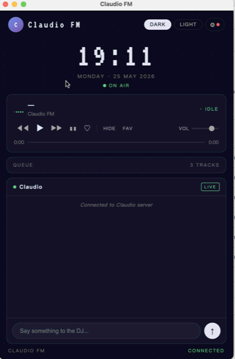
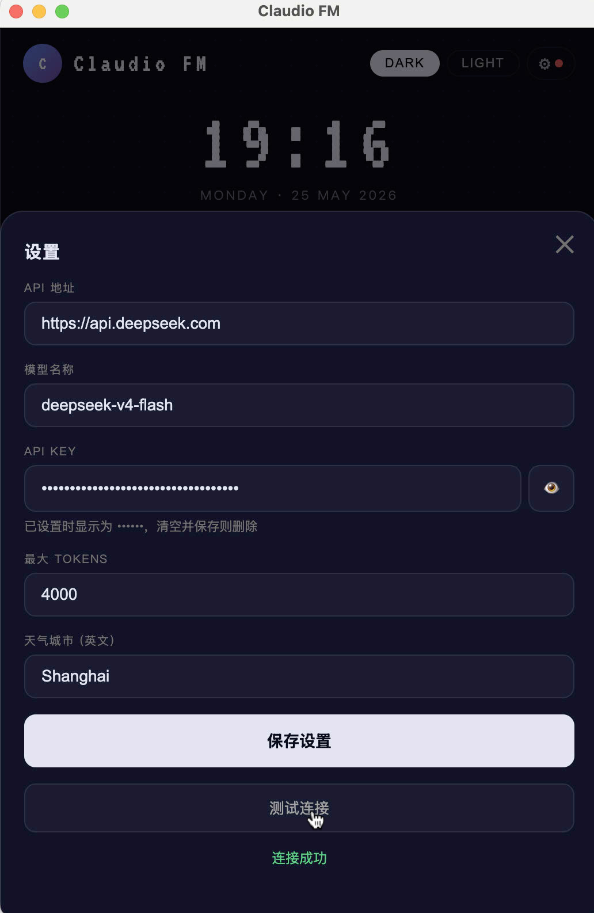
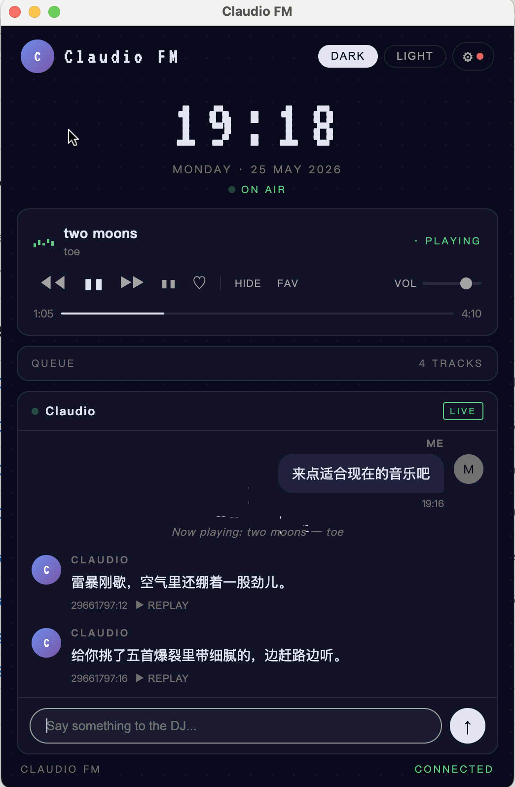
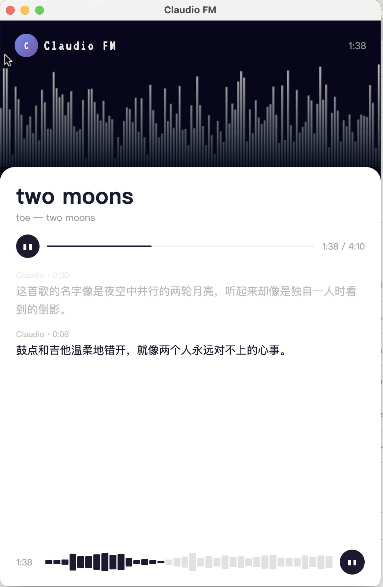

# Claudio FM

> 你的私人 AI 电台 — 读懂你的音乐口味，像 DJ 一样为你播报，根据时间、天气和心情自动选歌。

---

## 致谢

感谢 **秒秒 Guo**（小红书：[@shadow_0115](https://www.xiaohongshu.com/user/profile/55a508e8c2bdeb432f5763e2)）给予的产品思路启发。相信美好的东西值得分享。

---

## 使用说明

### 1. 下载

前往 [Releases](https://github.com/taurusjun2-dev/claudio/releases) 下载最新版本：
- **macOS**：下载 `.dmg` 文件，拖入应用程序文件夹
- **Windows**：下载 `.exe` 安装包

---

### 2. 主界面



启动后进入主界面，包含：
- 实时时钟 + ON AIR 指示
- 播放器控制栏（上一首 / 播放 / 下一首 / 音量）
- 队列列表
- 与 DJ 对话框

---

### 3. 配置 LLM

点击右上角 ⚙ 按钮，打开设置面板：



填写以下信息：

| 字段 | 说明 | 示例 |
|------|------|------|
| API 地址 | LLM 服务地址 | `https://api.deepseek.com/v1` |
| 模型名称 | 模型 ID | `deepseek-chat` |
| API Key | 访问密钥 | `sk-xxx` |
| 天气城市 | 影响选歌情绪 | `Shanghai` |

填完后点「测试连接」验证，成功后保存。

---

### 4. 与 DJ 对话



在底部输入框与 DJ 交流，例如：
- `来一首适合现在的音乐...`（直接点发送）
- `来首 City Pop`
- `来点适合深夜的`
- `真好听` — DJ 会回应你的感受，不会打断当前播放

队列播完后自动续歌，无需干预。

---

### 5. 音乐详情页



点击正在播放的歌曲标题，进入详情页：
- DJ 用 1-3 句话轻声介绍这首歌的背景或故事
- 句子逐渐出现，配合 TTS 朗读
- 点击 Logo 返回主页

---

## 技术架构

```
用户语料 (user/*.md)
        +
  LLM (DeepSeek / 任意 OpenAI 兼容接口)
        +
  网易云音乐 (NeteaseCloudMusicApi)
        +
  TTS (edge-tts，免费无需 Key)
        ↓
  本地 Node.js 服务
        ↓
  Electron 桌面应用 (Mac / Windows)
```

### 技术栈

| 层 | 技术 |
|----|------|
| 桌面壳 | Electron |
| 后端 | Node.js + Express + WebSocket |
| LLM | 任意 OpenAI 兼容接口（默认 DeepSeek） |
| 音乐 | NeteaseCloudMusicApi（非官方） |
| TTS | edge-tts（微软 Edge 语音引擎） |
| 持久化 | SQLite（node:sqlite 内置模块） |
| 前端 | 原生 HTML/CSS/JS，PWA 可安装 |

### Prompt 架构（6 片上下文）

每次 DJ 回应前，系统会将以下内容拼合成一段完整 Prompt：

1. DJ 人格设定（`prompts/dj-persona.md`）
2. 用户音乐品味（`user/taste.md` 等）
3. 环境信息（当前时间、天气）
4. 播放记忆（最近播放 + 对话历史）
5. 用户输入
6. 执行上下文（当前播放歌曲、队列状态）

---

## 个性化

编辑 `user/` 目录下的文件，让 Claudio FM 真正了解你：

| 文件 | 内容 |
|------|------|
| `taste.md` | 喜欢/不喜欢的风格、近期在循环的歌 |
| `routines.md` | 工作日/周末各时段的音乐偏好 |
| `mood-rules.md` | 天气、情绪与音乐风格的映射规则 |
| `playlists.json` | 收藏歌单 |

---

## 版权

本项目采用 [CC BY-NC 4.0](https://creativecommons.org/licenses/by-nc/4.0/deed.zh) 协议授权。

你可以自由地：
- **分享** — 复制、发行本作品
- **演绎** — 修改、转换本作品

但须遵守以下条件：
- **署名** — 须注明原作者（taurusjun2-dev）及致谢来源
- **非商业性使用** — 不得将本作品用于商业目的

音乐版权归原版权方所有，网易云音乐 API 为非官方接口，使用时请遵守相关服务条款。

© 2026 taurusjun2-dev
